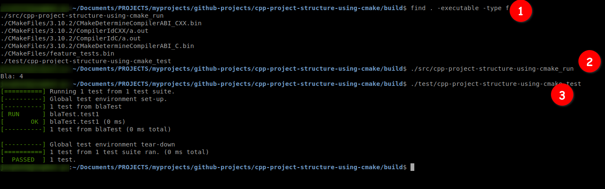

### C++ project structure


### compile all the things
```bash
$  cd build
$ cmake .. -DCMAKE_BUILD_TYPE=Debug -G "Unix Makefiles" 
```

### compile the project
```bash
$ make all
```
### find your executables
```bash
$ find . -executable -type f
```
### Run all things



### compile and run the tests

```bash
$ make cpp-project-structure-using-cmake_test; test/cpp-project-structure-using-cmake_test
```


### Reference
- https://raymii.org/s/tutorials/Cpp_project_setup_with_cmake_and_unit_tests.html